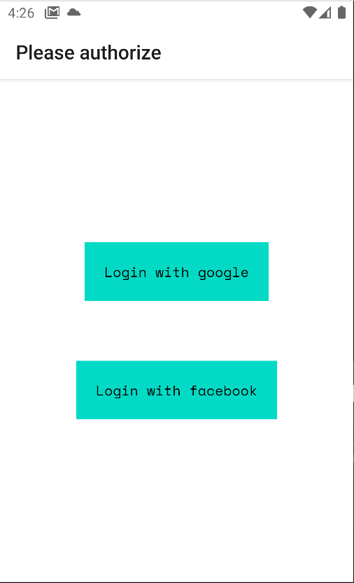

# ExpoAuthApp

#### [Test task requirement](https://github.com/iguverse/tasks-candidates/issues/7)

#### Application screenshots

    
    

### How do I get set up?

#### Required software

- [Yarn](https://yarnpkg.com/en/)
- [Node.js](https://nodejs.org/en/) Node v14.18.0 or newer
- [EAS CLI](https://docs.expo.dev/build/setup/) v2.8.0

#### Install dependencies

- install dependencies with `yarn`

#### Run Dev Web 

- run with `yarn web`

#### Run Dev Android

- bootstrap the emulator OR connect android device
- generate debug application with `yarn android:eas:dev` or `yarn android:eas:dev --local` (if you have react-native environment)
- install generated debug application to simulator/device and install it
- run bundler with `yarn start`
- open generated debug application

#### Deploy web

- run with `yarn deploy:web`

#### Deploy android

- generate prod `.aab` package ready to upload to google play with `yarn android:eas:prod` or `yarn android:eas:prod --local` (if you have react-native environment)

### Type checking

- run the type checker with `npx tsc`
